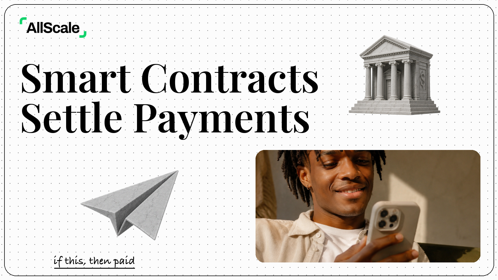
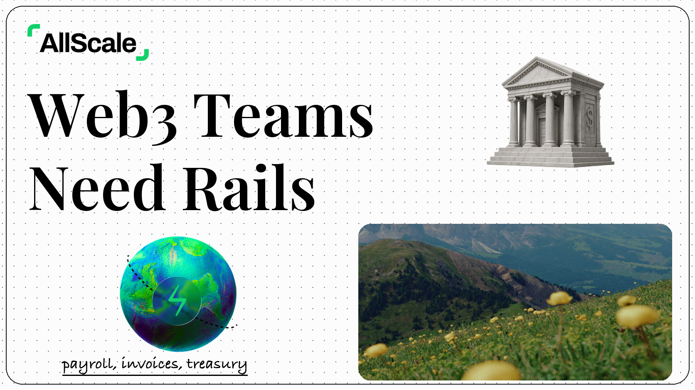

# AllScale Article Cover

> 把 AllScale 博客文章、草稿、URL 或营销主题，生成一张干净、编辑感强、可直接用于文章头图和社交预览的封面图。
>
> 横版封面 | AllScale 品牌素材 | 点阵白底 | Playfair Display 标题 | 金融拼贴 | Codex Skill

---

## 这个仓库是什么

AllScale Article Cover 是一个 Codex Skill，用来指导 AI Agent 为 AllScale 风格的文章生成封面图。

它不是通用海报 prompt，也不是 SaaS landing page hero 模板。它的目标很明确：先理解文章要表达的业务主题，再把标题、品牌、金融对象、照片卡片和留白组织成一张稳定的 AllScale editorial cover。

这套 skill 特别强调几个关键点：

- 使用原始 AllScale logo，不重绘、不改色、不重新生成
- 使用原始点阵背景，不重绘、不改色、不重新生成
- 主标题必须是 2 行，并使用 Playfair Display SemiBold
- 图标从 `object-pack.png` 里选择，不重新设计、不重绘、不风格化、不改色
- 右下角照片卡不能露出素材板绿色边缘
- 所有元素之间必须有清晰 breaking space

一句话：**让 Codex 为 AllScale 文章稳定生成一张像设计师排过版的品牌封面。**

---

## 适合谁用

特别适合：

- 为 AllScale 博客文章生成封面图
- 为稳定币支付、Web3 payroll、treasury、DAO、AI agent、smart contract payment 等主题生成文章头图
- 想保持 AllScale 统一视觉系统的人
- 想让 Codex 复用固定品牌素材和封面布局的人
- 需要快速生成 blog header / social preview / thumbnail 的内容团队

不适合：

- 想生成完全不同品牌视觉的人
- 想生成深色 crypto cyberpunk 海报的人
- 想生成 dashboard UI、pitch deck、infographic 的人
- 想让 AI 自由重绘 AllScale logo 或素材图标的人
- 需要 Figma 源文件或严格可编辑矢量源文件的人

---

## 它会产出什么

默认输出：

- 一张宽屏横版 AllScale 风格文章封面
- 两行大标题
- AllScale logo
- 点阵白色背景
- 右上和左下两个精选对象图标
- 右下圆角照片卡
- 可选手写小标题
- 最终 PNG 图片，保存到 workspace 的 `assets/<article-slug>-cover/`

默认不输出：

- PPTX / PDF / Keynote
- Figma / PSD 源文件
- SVG 可编辑图
- 多张正文配图
- 大段文字型信息图

---

## 视觉风格

这个 skill 默认使用 AllScale editorial cover 风格：

- 白色点阵背景
- 细黑色外边框，40px 圆角，60% corner smoothing
- 左上角 AllScale logo，贴近主标题
- Playfair Display SemiBold 超大黑色标题
- 主标题严格 2 行，line-height 等于字体大小
- logo 宽度约等于 2.5 个标题字母宽
- 大量留白和清晰 breaking space
- 右上和左下使用 object-pack 里的金融/基础设施对象
- 右下使用圆角照片卡，右边距和下边距一致
- 绿色只作为克制品牌点缀，不能主导画面

---

## 示例效果

### Smart Contracts For Business Payments



### Web3 Financial Infrastructure



### AI Agents Stablecoin Payments


这些图片是风格校准样例。使用时应该根据当前文章重新选择标题、对象图标和照片卡，不要机械复刻旧案例。

---

## 安装

克隆仓库：

```bash
git clone https://github.com/Jony-ren/allscale-article-cover.git
cd allscale-article-cover
```

复制 skill 到 Codex skills 目录：

```bash
mkdir -p "${CODEX_HOME:-$HOME/.codex}/skills"
cp -R ./allscale-article-cover "${CODEX_HOME:-$HOME/.codex}/skills/"
```

安装后，在 Codex 里使用：

```text
Use $allscale-article-cover 帮我生成这篇文章的封面图：https://www.allscale.io/posts/smart-contracts-business-payments
```

---

## 怎么用

### 用 URL 生成封面

```text
Use $allscale-article-cover 生成封面图：
https://www.allscale.io/posts/smart-contracts-business-payments
```

### 用文章标题生成封面

```text
Use $allscale-article-cover 为这个主题生成一张 AllScale 风格封面：
Stablecoin Payroll for Global Contractors
```

### 要求解释为什么这么生成

```text
Use $allscale-article-cover 生成封面图：
https://www.allscale.io/posts/ai-agents-stablecoin-payments-autonomous-financial-automation

并且告诉我为什么这么生成。
```

### 只做标题和视觉方向

```text
Use $allscale-article-cover 先不要生图。
请根据这篇文章给我 3 个两行封面标题方案，并说明应该选哪两个 object-pack 图标。
```

更多示例见 [examples/prompts.md](examples/prompts.md)。

---

## 工作流程

这个 skill 的流程是：

1. 读取文章 URL、标题、草稿或用户给的主题
2. 提炼文章核心角度、情绪和金融/业务隐喻
3. 改写成适合封面的两行短标题
4. 从 `object-pack.png` 中选择两个最贴合主题的对象图标
5. 选择一张适合右下角照片卡的图像素材
6. 使用原始 AllScale logo 和原始点阵背景
7. 按 AllScale editorial cover 布局生成或合成封面
8. 按 QA checklist 检查标题、logo、留白、照片边缘、对象图标和品牌一致性
9. 保存最终 PNG，并报告用途和路径

---

## 目录结构

```text
.
├── README.md
├── LICENSE
├── NOTICE.md
├── examples/
│   ├── images/
│   │   ├── 01-smart-contracts-business-payments-cover.png
│   │   ├── 02-web3-financial-infrastructure-cover.png
│   │   └── 03-ai-agents-stablecoin-payments-cover.png
│   └── prompts.md
└── allscale-article-cover/
    ├── SKILL.md
    ├── agents/
    │   └── openai.yaml
    ├── assets/
    │   ├── brand/
    │   │   ├── allscale-logo.png
    │   │   └── dot-bg.jpg
    │   └── examples/
    │       ├── target-cover.png
    │       ├── object-pack.png
    │       └── photo-pack.png
    └── references/
        ├── style-dna.md
        ├── asset-rules.md
        ├── prompt-template.md
        └── qa-checklist.md
```

真正需要安装到 Codex 的是子目录：

```text
allscale-article-cover/
```

根目录的 README、LICENSE、NOTICE 和 examples 是 GitHub 分享文档。

---

## 注意事项

- 主标题越短越稳定，优先 4-8 个英文单词。
- 主标题必须严格两行。
- 图片模型可能会改 logo 或图标，所以使用时应优先复用本仓库 assets 里的原始素材。
- 右下角照片卡必须裁进照片内容内部，不能露出绿色素材板边缘。
- 如果没有安装 Figma Hand，小标题可能需要使用最接近的系统手写字体替代。
- 示例图只是风格校准样例，不是每篇文章都要复刻同一组素材。

---

## 相关项目

- [Ian Xiaohei Illustrations](https://github.com/helloianneo/ian-xiaohei-illustrations) — 中文小黑怪诞正文配图 Skill
- [Ian Handdrawn PPT](https://github.com/helloianneo/ian-handdrawn-ppt) — 中文手绘技术 PPT-style 页面图生成 Skill
- [Awesome Claude Code Skills](https://github.com/helloianneo/awesome-claude-code-skills) — Claude Code Skills / Agents / Plugins 精选合集

---

## 关于作者

**Ian (伊恩)** — 产品设计师 / 一人公司实践者 / AI Builder

用 AI 团队打造一人公司。

- GitHub: [Jony-ren](https://github.com/Jony-ren)
- X/Twitter: [@ianneo_ai](https://x.com/ianneo_ai)
- 网站: [www.ianneo.xyz](https://www.ianneo.xyz)
- 微信: `ianneoxyz`
- 邮箱: hello.neoc@gmail.com

---

## License

MIT License. See [LICENSE](LICENSE).
